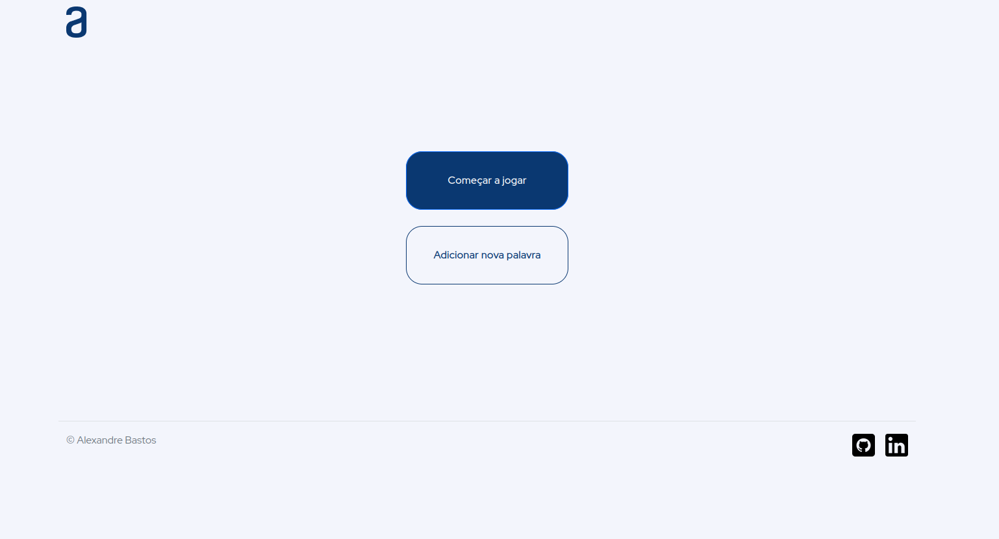
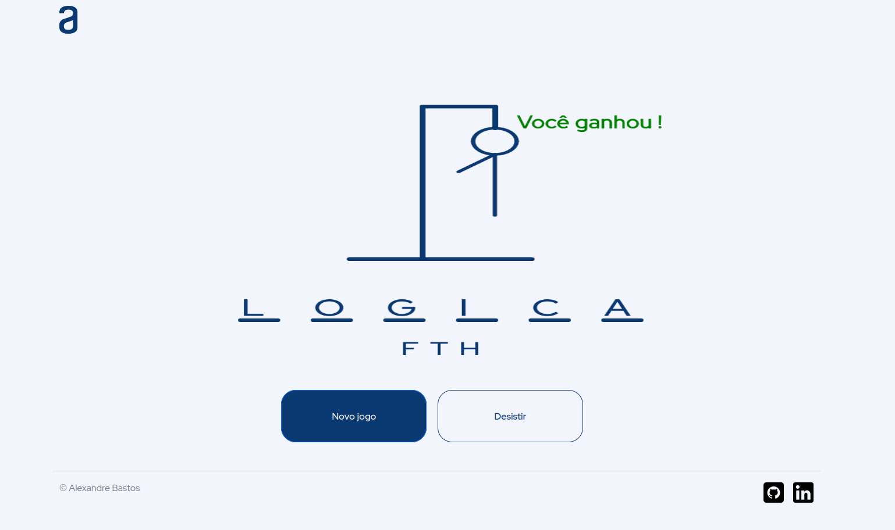

# JogoDaForca - Challenge Programa Oracle ONE

Nesse desafio feito durante a formação da Oracle tive que desenvolver um Jogo da Forca usando HTML e CSS para construir o layout do projeto e JavaScript para implementar a lógica do jogo.

### RESULTADO FINAL

</img>

</img>
